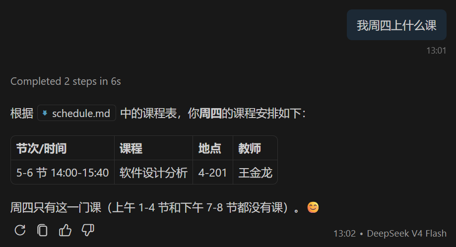

# 构建mcp服务器

> 本教程将带你使用 `TypeScript` 构建你的第一个mcp服务器，并且在vscode的github copliot中真实地使用它！你也可以查看[官方教程](https://modelcontextprotocol.io/docs/2026-07-28/develop/build-server)。

## 我们要做什么？

做一个本地的课程表，让你的ai可以知道你的课程表。

## 前提条件

- 你需要Node.js和npm，确保Node.js的版本在20及以上。
- 有vscode。
- 懂中文。<del>_这对吗?_</del>

## 第一步：搭建项目

```bash
npm init -y # 初始化package.json

# 下载依赖
npm install @modelcontextprotocol/server zod
npm install -D @types/node typescript
```

```json
// package.json
{
    "type": "module",
    "scripts": {
        "build": "tsc"
    },
    "files": ["build"]
}
```

```json
// tsconfig.json
{
    "compilerOptions": {
        "target": "ES2022",
        "module": "Node16",
        "moduleResolution": "Node16",
        "types": ["node"],
        "outDir": "./build",
        "rootDir": "./src",
        "strict": true,
        "esModuleInterop": true,
        "skipLibCheck": true,
        "forceConsistentCasingInFileNames": true
    },
    "include": ["src/**/*"],
    "exclude": ["node_modules"]
}
```

## 第二步：写逻辑

```ts
// src/index.ts
import { McpServer } from "@modelcontextprotocol/server";
import { serveStdio } from "@modelcontextprotocol/server/stdio";
import { readFileSync } from "node:fs";
import path from "node:path";
import { fileURLToPath } from "node:url";

const SCHEDULE_MARKDOWN = readFileSync(path.join(path.dirname(fileURLToPath(import.meta.url)), "..", "data", "schedule.md"), "utf-8");

serveStdio(() => {
    const server = new McpServer({
        name: "class-info",
        version: "1.0.0",
    });
    server.registerResource(
        "course-schedule",
        "class://schedule",
        {
            title: "我的课程表",
            description: "2026 秋季学期的课程表",
            mimeType: "text/markdown",
        },
        async (uri) => ({
            contents: [{ uri: uri.href, text: SCHEDULE_MARKDOWN }],
        }),
    );

    return server;
});
```

```md
<!-- data/schedule.md -->

# 2026 秋季学期课程表

## 一、每周课程安排

| 节次/时间          | 周一         | 周二         | 周三         | 周四         | 周五 |
| ------------------ | ------------ | ------------ | ------------ | ------------ | ---- |
| 1-2 节 08:00-09:40 | 软件设计分析 | —            |              |              | —    |
| 3-4 节 10:00-11:40 |              | 软件设计分析 | 习近平思想   |              |      |
| 5-6 节 14:00-15:40 | —            |              | — 习近平思想 | 软件设计分析 |      |
| 7-8 节 16:00-17:40 | —            | —            |              | —            | —    |

## 二、课程详细信息

### 软件设计分析

上课地点：4-201

教师：王金龙

### 习近平思想

上课地点：5-404

教师：汤名一
```

## 第三步：导入vscode

在项目根目录新加一个 `.vscode` 文件夹，然后，里面新增 `mcp.json` 文件：

```json
{
    "servers": {
        "class-info": {
            "type": "stdio",
            "command": "node",
            "args": ["build/index.js"]
        }
    }
}
```

然后，将项目构建：
``` bash
npm run build
```


## 第四步：启用并测试

点击vscode侧边栏的小齿轮，选择mcp服务器，就可以看到刚刚写的class-info了，然后启动mcp服务器，提问ai：
