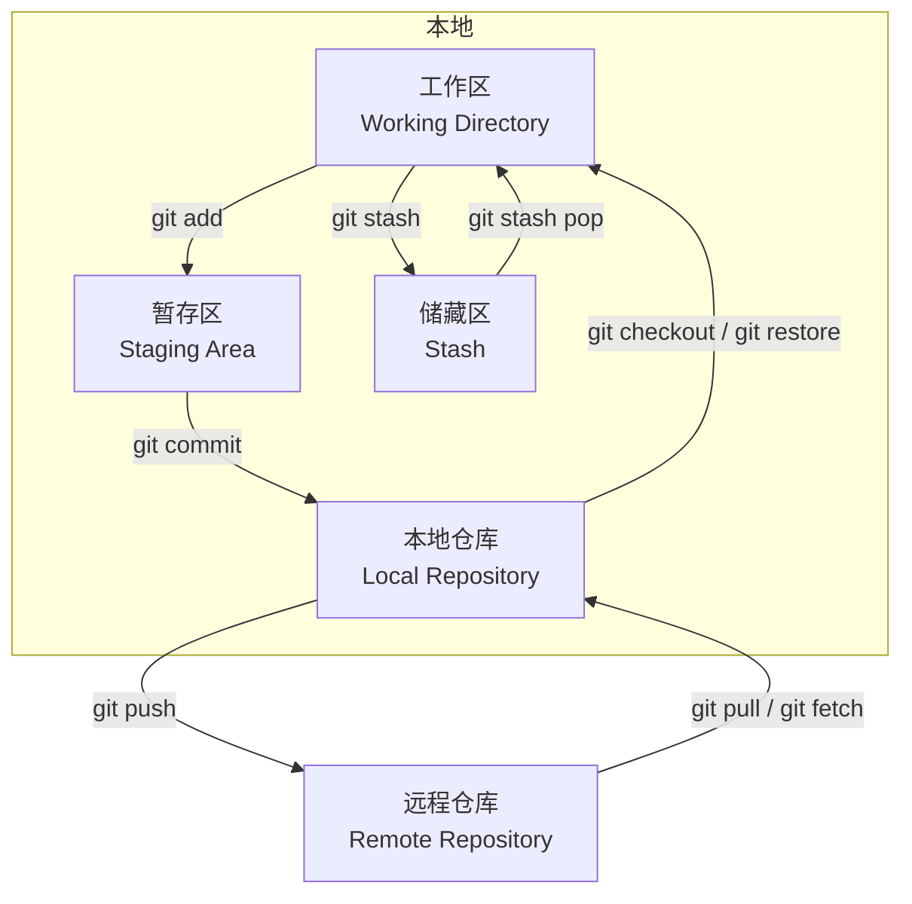
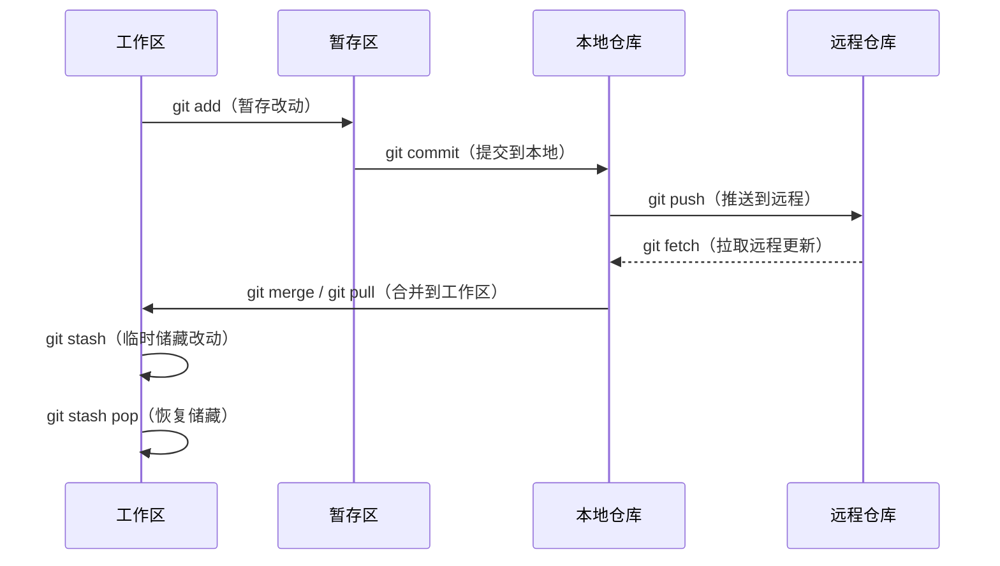

# Git 的工作流程

Git 的工作流围绕五个核心区域展开，理解它们之间的关系是掌握 Git 的关键。

## 五个核心区域



### 工作区（Working Directory）

工作区就是你电脑上能看到的项目文件夹，你在这里编辑代码、新增文件、删除文件。Git 会监控这个目录下所有文件的变动。

工作区中的文件有两种状态：

| 状态 | 说明 |
|------|------|
| **未跟踪（Untracked）** | 新创建的文件，Git 还不知道它的存在 |
| **已跟踪（Tracked）** | 已被 Git 管理的文件，又分为未修改、已修改、已暂存 |

查看工作区状态：

```bash
git status
```

### 暂存区（Staging Area / Index）

暂存区是提交之前的"购物车"。你通过 `git add` 把工作区的改动放入暂存区，告诉 Git："下次提交时把这些变更包含进去"。

它让你可以精确控制每次提交的内容——不用一次性提交所有改动，而是挑选部分文件分批提交。

```bash
# 将指定文件加入暂存区
git add <文件名>

# 将所有变更加入暂存区
git add .

# 将暂存区的文件撤回工作区
git restore --staged <文件名>
```

### 本地仓库（Local Repository）

本地仓库是 Git 的核心，存放在项目根目录的 `.git` 文件夹中。`git commit` 会把暂存区的内容永久保存到本地仓库，生成一个快照（commit）。

每个 commit 都包含完整的项目快照、作者、时间、提交信息，并指向上一个 commit，形成一条历史链。

```bash
# 提交暂存区内容到本地仓库
git commit -m "描述信息"

# 查看提交历史
git log --oneline --graph

# 查看某次提交的详情
git show <commit-hash>
```

### 储藏区（Stash）

储藏区是一个临时存放区。当你正在开发一个功能，突然需要切换到别的分支处理紧急问题，但又不想提交当前半成品代码时，可以用 `git stash` 把工作区和暂存区的改动暂存起来。

```bash
# 储藏当前所有改动
git stash

# 储藏时添加描述信息
git stash push -m "正在开发登录功能"

# 查看储藏列表
git stash list

# 恢复最近一次储藏（保留储藏记录）
git stash apply

# 恢复最近一次储藏并删除记录
git stash pop

# 删除某个储藏
git stash drop stash@{0}

# 清空所有储藏
git stash clear
```

### 远程仓库（Remote Repository）

远程仓库是托管在服务器上的 Git 仓库（如 GitHub、GitLab），用于团队协作和代码备份。通过 `git push` 把本地提交推送到远程，通过 `git pull` 拉取远程更新。

```bash
# 查看远程仓库
git remote -v

# 添加远程仓库
git remote add origin <仓库地址>

# 推送本地提交到远程
git push origin <分支名>

# 拉取远程更新并合并
git pull

# 只拉取不合并
git fetch
```

## 完整工作流

一个典型的 Git 工作流如下：



一句话总结：**工作区编辑 → 暂存区筛选 → 本地仓库保存 → 远程仓库共享**，而储藏区是随时可用的"暂存抽屉"。
