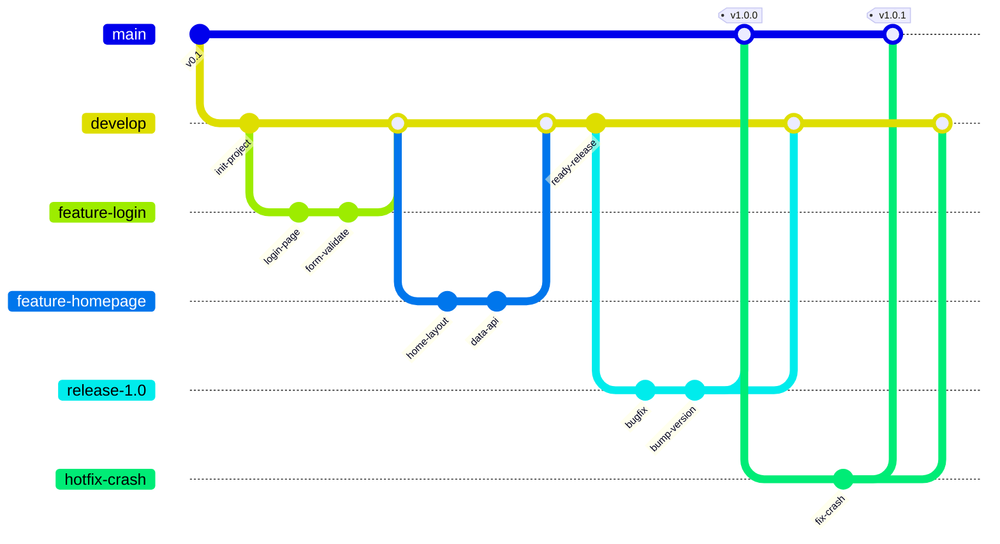

# GitFlow 工作流

GitFlow 是一种 Git 分支管理模型，定义了严格的分支角色和使用规范。`git-flow` 工具随 **Git for Windows** 捆绑安装，无需额外下载。

## 分支结构

| 分支 | 用途 | 从哪拉 | 合并到哪 |
|------|------|--------|---------|
| `main` | 生产就绪代码 | — | — |
| `develop` | 日常开发主分支 | — | — |
| `feature/*` | 新功能开发 | `develop` | `develop` |
| `release/*` | 发布准备 | `develop` | `main` + `develop` |
| `hotfix/*` | 紧急修复 | `main` | `main` + `develop` |
| `bugfix/*` | 修复未发布分支的 bug | 当前分支 | 当前分支 |

## 工作流程



## 操作步骤

### 初始化

```bash
# 初始化 git-flow（使用默认分支名）
git flow init -d

# 推送 main 和 develop 到远程
git push -u origin main develop
```

### 开发新功能

```bash
# 拉取最新 develop
git checkout develop
git pull

# 开始新功能
git flow feature start <功能名>

# 推送到远程（多人协作）
git flow feature publish <功能名>

# 完成功能开发（合并回 develop）
git flow feature finish <功能名>

# 推送 develop
git push origin develop
```

### 发布版本

```bash
# 从 develop 创建 release
git flow release start <版本号，如 1.0.0>

# 在 release 上做最终测试和修复

# 完成发布（合并到 main + develop，自动打 tag）
git flow release finish <版本号>

# 推送 main、develop 和 tags
git push origin main develop
git push --tags
```

### 紧急修复

```bash
# 从 main 拉出 hotfix
git flow hotfix start <修复名>

# 修复问题

# 完成（合并到 main + develop，自动打 tag）
git flow hotfix finish <修复名>

# 推送
git push origin main develop
git push --tags
```

## 重要规则

1. **禁止直接往 `main` 或 `develop` 提交** — 所有改动必须通过 feature/hotfix/release 分支
2. **release / hotfix 完成后必须 `git push --tags`**
3. **feature 命名用简短英文**，如 `user-auth`、`add-dashboard`、`daily-updates`
4. **多人协作** 时，用 `git flow feature publish <名>` 推送分支，协作者用 `git flow feature pull origin <名>` 拉取
5. **不要擅自 finish** — 创建分支后，等明确需要合并时再执行 finish
