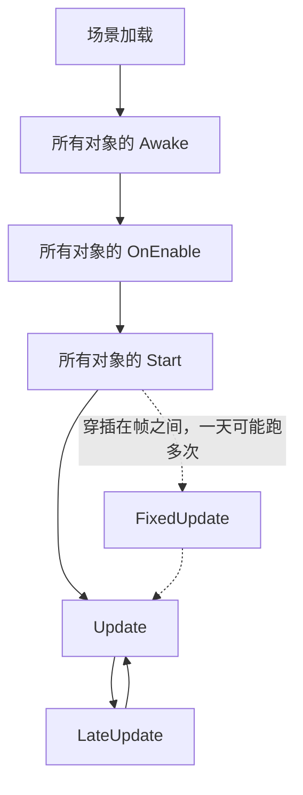

# Unity 执行顺序

Unity 脚本不是从头到尾跑一遍的，而是由引擎在特定时机回调。继承 `MonoBehaviour` 后写下的 `Awake`、`Start`、`Update`、`FixedUpdate` 这些方法，就是引擎留给我们的「插槽」。

::: tip 提示
本文只是个人学习笔记，更权威的内容建议查看[Unity 官方文档](https://docs.unity3d.com/cn/current/Manual/ExecutionOrder.html)
:::

## 常用回调

| 方法 | 调用次数 | 调用时机 | 典型用途 |
| --- | --- | --- | --- |
| `Awake` | 一次 | 对象被加载时，即使脚本未启用也会调用 | 初始化自身数据、获取组件引用 |
| `Start` | 一次 | 第一帧 `Update` 之前，且仅在脚本启用时调用 | 需要依赖其他对象已初始化的逻辑 |
| `Update` | 每帧一次 | 每渲染一帧调用 | 输入检测、计时、非物理的位移 |
| `FixedUpdate` | 每秒固定次数 | 按固定时间间隔调用，与帧率无关 | 物理计算、`Rigidbody` 位移 |

## 执行顺序

同一场景里，三者的先后顺序是固定的：



`FixedUpdate` 是独立的一条时间线，不按渲染帧走，所以它在图中是穿插在帧之间执行的（下面单独讲）。

关键点在于 **Awake 和 Start 不是交替执行的**：

- 所有对象的 `Awake` 全部跑完，才开始跑 `Start`
- 所以可以在 `Awake` 里安全地引用其他对象，因为对方至少已经 `Awake` 过了
- 但对方可能还没 `Start`，它的初始化数据未必就绪

## Awake

对象被实例化时调用，早于 `Start`。常用于拿到自身组件的引用：

```csharp
using UnityEngine;

public class Player : MonoBehaviour
{
    // 提前声明，避免每帧调用 GetComponent
    private Rigidbody rb;
    private Animator animator;

    void Awake()
    {
        // 获取自身组件引用，此时其他对象也已完成 Awake
        rb = GetComponent<Rigidbody>();
        animator = GetComponent<Animator>();
    }
}
```

::: warning 警告
不要在 `Awake` 里访问其他对象的 `Start` 才赋值的数据，那些数据此刻还是空的。
:::

## Start

在第一帧 `Update` 之前调用，且只调用一次。适合写依赖外部对象已就绪的逻辑：

```csharp
void Start()
{
    // 此时所有对象的 Awake 都已完成，可以放心读取别人的数据
    var spawnPoint = GameObject.Find("SpawnPoint");
    transform.position = spawnPoint.transform.position;
}
```

`Start` 和 `Awake` 的区别只有一个：如果脚本组件被禁用（Inspector 里取消勾选），`Awake` 照样执行，`Start` 会推迟到组件被启用后才执行。

## Update

每帧调用一次，频率和帧率绑定。放和画面同步的逻辑：

```csharp
void Update()
{
    // 按键检测：Input.GetAxis 每帧读取一次
    float h = Input.GetAxis("Horizontal");
    float v = Input.GetAxis("Vertical");

    // 乘上 deltaTime，让移动速度不受帧率影响
    transform.Translate(new Vector3(h, 0, v) * 5f * Time.deltaTime);
}
```

::: tip 提示
`Update` 里做位移、计时一定要乘 `Time.deltaTime`（上一帧耗时）。否则帧率高的机器跑得更快。
:::

## FixedUpdate

按**固定时间间隔**调用，默认 0.02 秒（即每秒 50 次），和帧率无关。物理引擎就靠这个稳定的步长做运算，所以涉及 `Rigidbody`、力、关节的逻辑都应该放这里：

```csharp
void FixedUpdate()
{
    // 施力：物理运算必须在固定步长下进行，结果才稳定
    rb.AddForce(Vector3.forward * 10f);

    // 固定间隔的位移，用 fixedDeltaTime 而不是 deltaTime
    rb.MovePosition(rb.position + Vector3.forward * 2f * Time.fixedDeltaTime);
}
```

### 时间间隔怎么改

在 `Edit` → `Project Settings` → `Time` → `Fixed Timestep` 里修改，脚本里对应只读属性 `Time.fixedDeltaTime`。调小会更精确但更耗性能，一般不要动默认值。

### 和 Update 的关系

- 一帧内 `FixedUpdate` 的调用次数**不固定**：帧率低时一帧会补跑多次，帧率高时可能一帧一次都不跑
- 因为调用次数不对等，不要用它做「每帧只变一次」的插值或动画
- 输入检测放 `Update`：`FixedUpdate` 里直接读 `Input` 可能漏掉按键，应该先在 `Update` 里记录状态，再到 `FixedUpdate` 里使用
- 需要平滑表现的物理运动，可以在 `Update` 里用 `rigidbody.position` 做插值

::: tip 提示
一句话选择标准：**跟物理引擎打交道 → `FixedUpdate`；跟画面、输入、UI 打交道 → `Update`。**
:::

## 容易踩的坑

- **`Update` 里不要写 `GetComponent`**：每帧调用开销很大，引用应该缓存在 `Awake` 里
- **物理逻辑不要放 `Update`**：改用 `FixedUpdate`，它以固定时间间隔（默认 0.02s）调用
- **`FixedUpdate` 里不要用 `Time.deltaTime`**：要用 `Time.fixedDeltaTime`，否则速度会随帧率跳动
- **相机跟随不要放 `Update`**：改用 `LateUpdate`，等所有 `Update` 结束后再执行，避免画面抖动
- **方法的执行顺序不取决于代码里的书写位置**，只取决于引擎的回调时机
