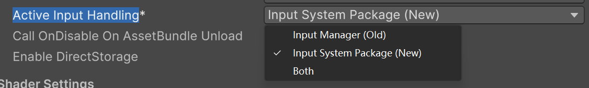

# 输入系统

输入系统分为新版和旧版本。

Unity 里有两套并行的输入方案：旧的 `Input Manager` 和新的 `Input System Package`。两者的 API 完全不兼容，可以在项目设置里切换。

::: tip 提示
本文只是个人学习笔记，更权威的内容建议查看[Unity 官方文档](https://docs.unity3d.com/cn/current/Manual/Input.html)
:::

## 在哪里切换

1. `Edit → Project Settings → Player`
2. 找到 **Active Input Handling**



三个选项的区别：

| 选项 | 说明 |
| --- | --- |
| `Input Manager (Old)` | 只用旧版，`Input.GetKey` 这类 API 可用 |
| `Input System Package (New)` | 只用新版，写旧 API 会直接抛异常 |
| `Both` | 两套同时启用 |

::: warning 警告
切换后 Unity 会提示重启编辑器，一定要重启，否则设置不生效。
:::

::: warning 警告
选了 `New` 之后，代码里再写 `Input.GetAxis` 会报 `InvalidOperationException`。要么全部改成新版 API，要么临时选 `Both`。`Both` 会让两套系统同时运行，有额外开销，只适合过渡期。
:::

## 旧版 Input Manager

Unity 自带，不需要装包。特点：

- 全是静态 API：`Input.GetKey`、`Input.GetAxis`、`Input.GetMouseButton`
- 按键和轴的映射写在 `Edit → Project Settings → Input Manager` 里，代码里用字符串名字去取
- 只能在每帧「轮询」，问一次「现在按着没」

| API | 说明 |
| --- | --- |
| `Input.GetKey(KeyCode.Space)` | 按键是否处于按下状态 |
| `Input.GetKeyDown(KeyCode.Space)` | 这一帧是否刚按下 |
| `Input.GetKeyUp(KeyCode.Space)` | 这一帧是否刚松开 |
| `Input.GetAxis("Horizontal")` | 带平滑的轴值，范围 -1 到 1 |
| `Input.GetAxisRaw("Horizontal")` | 不做平滑，只有 -1、0、1 |
| `Input.GetMouseButton(0)` | 鼠标按键，0 左键、1 右键、2 中键 |
| `Input.GetButtonDown("Jump")` | 按 Input Manager 里定义的名字取 |

```csharp
using UnityEngine;

public class LegacyInput : MonoBehaviour
{
    public float speed = 5f;

    void Update()
    {
        // 移动：GetAxis 自带平滑过渡，手感更柔和
        float h = Input.GetAxis("Horizontal");
        float v = Input.GetAxis("Vertical");
        transform.Translate(new Vector3(h, v, 0) * speed * Time.deltaTime);

        // 单次触发：GetKeyDown 只在按下的那一帧为 true
        if (Input.GetKeyDown(KeyCode.Space))
        {
            Debug.Log("跳跃");
        }

        // 鼠标：0 左键 1 右键 2 中键
        if (Input.GetMouseButtonDown(0))
        {
            Debug.Log("开火");
        }
    }
}
```

::: warning 警告
`GetKey` 是「按着就一直为真」，`GetKeyDown` 只在按下的那一帧为真。写跳跃、开火这类单次动作必须用 `GetKeyDown`，否则按住期间每帧都会触发一次。
:::

旧版的短板：

- 用字符串取轴名，写错了要跑起来才发现，没有编译期检查
- 重绑定只能改 Input Manager 里的配置，不能运行时改，也没法按玩家分别保存
- 不同型号手柄的适配要自己处理

## 新版 Input System

需要先在 `Window → Package Manager` 里安装 `Input System` 包。

核心概念：

| 概念 | 说明 |
| --- | --- |
| Action | 一个「动作」，比如跳跃、移动，代码关心动作而不是具体按键 |
| Action Map | 一组 Action 的集合，比如 `Player`、`UI` |
| Binding | 动作到具体按键/轴的绑定，一个动作可以有多个绑定 |
| Control Scheme | 输入方案，比如键盘鼠标、手柄 |
| Interactions | 交互方式，比如 `Hold`、`Tap`、`Press` |
| Processors | 数值处理，比如 `Invert`、`Scale`、`StickDeadzone` |

三种使用方式，从简单到灵活：

1. `PlayerInput` 组件配 `Unity Events`，不写代码也能接
2. 代码里直接读 `InputAction`
3. 用 `InputActionAsset` 生成 C# 类，类型安全地调用

### 回调式读取

```csharp
using UnityEngine;
using UnityEngine.InputSystem;

public class NewInput : MonoBehaviour
{
    private InputAction moveAction;
    private InputAction jumpAction;

    void Awake()
    {
        // 取项目里配置好的动作
        moveAction = InputSystem.actions.FindAction("Player/Move");
        jumpAction = InputSystem.actions.FindAction("Player/Jump");
    }

    void OnEnable()
    {
        // 订阅事件：只在真正触发时回调，不用每帧轮询
        jumpAction.performed += OnJump;
        moveAction.Enable();
        jumpAction.Enable();
    }

    void OnDisable()
    {
        // 一定要退订，否则对象销毁后回调还在，会报 MissingReferenceException
        jumpAction.performed -= OnJump;
        moveAction.Disable();
        jumpAction.Disable();
    }

    private void OnJump(InputAction.CallbackContext ctx)
    {
        Debug.Log("跳跃");
    }

    void Update()
    {
        // 连续性的输入还是每帧读一次值，比如移动方向
        Vector2 move = moveAction.ReadValue<Vector2>();
    }
}
```

### 三个回调时机

| 回调 | 时机 |
| --- | --- |
| `started` | 开始输入，比如刚按下 |
| `performed` | 达到触发条件，按钮就是按下的那一刻 |
| `canceled` | 输入结束，比如松开 |

新版的好处：

- 按键不写死在代码里，支持运行时重绑定
- 天生支持多设备、多玩家
- 事件驱动，不需要每帧轮询
- 输入配置是 asset，可以在编辑器里可视化编辑

## 该用哪个

| | 旧版 Input Manager | 新版 Input System |
| --- | --- | --- |
| 是否要装包 | 不用 | 要装 `Input System` |
| 写法 | 静态方法轮询 | 事件回调或读 Action |
| 运行时重绑定 | 不支持 | 支持 |
| 多设备 / 多玩家 | 麻烦 | 原生支持 |
| 学习成本 | 低 | 高一些 |

新项目建议直接用新版。维护老项目，或者只是做个小原型，旧版也够用。

## 踩坑记录

- 改完 `Active Input Handling` 必须重启编辑器
- 选了新版还写 `Input.GetAxis`，会抛 `InvalidOperationException`，报错信息里也会提示你去改设置
- 新版 Action 不调用 `Enable()` 就一直没有反应，不用时记得 `Disable()`
- 订阅了事件忘记 `-=` 退订，对象销毁后回调依然存在，会报 `MissingReferenceException`
- 手柄摇杆的死区用新版的 `StickDeadzone` Processor 处理，别自己在代码里写阈值