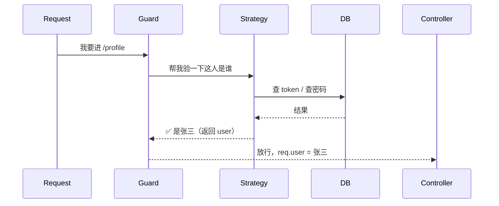

# NestJS 认证：Guard 与 Strategy 详解

> 基于 Passport + JWT 的认证流程，解读 Guard（守卫）和 Strategy（策略）的职责与协作。

---

## 核心概念

| | Guard（守卫） | Strategy（策略） |
|---|---|---|
| **角色** | 门卫 | 鉴定师 |
| **职责** | 决定放不放行 | 证明你是谁 |
| **问的问题** | "能进吗？" | "你是谁？凭什么？" |

Guard 站在路由前面拦截请求，它不关心你怎么验证的，只管结果：过还是不过。Strategy 负责具体的验证逻辑——查数据库、比密码、验签名。



---

## 一、LocalAuthGuard（登录验证）

### 完整调用链

```
请求 POST /api/auth/login { username, password }
  → LocalAuthGuard.canActivate()
  → LocalStrategy.validate(username, password)
  → AuthService.validateUserByUsername()
  → LocalAuthGuard.handleRequest(err, user, info)
  → Controller.login(req.user)
```

### 第 1 步：Guard 拦截请求

```ts
// local-auth.guard.ts
export class LocalAuthGuard extends AuthGuard('local') {
  //                          ↑ 'local' → 匹配到 LocalStrategy
```

`AuthGuard('local')` 是 Passport 内置逻辑，根据字符串 `'local'` 自动找到 `LocalStrategy`。

### 第 2 步：Strategy 从 body 取数据

```ts
// local.strategy.ts
constructor(private authService: AuthService) {
  super();  // 不传参数 → passport-local 默认从 req.body 取 username 和 password
}

async validate(username: string, password: string): Promise<User> {
  //          ↑ 这两个值就是 req.body.username 和 req.body.password
```

`super()` 不传配置，Passport 默认行为：
- 从 `req.body` 读 `username` → 传给 `validate()` 第 1 个参数
- 从 `req.body` 读 `password` → 传给 `validate()` 第 2 个参数
- 如果缺少字段 → 生成 `info = { message: 'Missing credentials' }`

### 第 3 步：Strategy 调 AuthService 验证

```ts
const user = await this.authService.validateUserByUsername(username, password);
//         ↑ 查数据库 + bcrypt 比密码
if (!user) {
  throw new UnauthorizedException('用户名或密码错误'); // → err 参数
} else {
  return user; // → user 参数
}
```

### 第 4 步：Guard.handleRequest 做最后裁决

Strategy 跑完后，三个结果传给 `handleRequest(err, user, info)`：

| 场景 | err | user | info |
|------|-----|------|------|
| 没填用户名/密码 | `null` | `null` | `{ message: 'Missing credentials' }` |
| 密码错误 | `UnauthorizedException` | `null` | — |
| 验证通过 | `null` | user 对象 | — |

```ts
// local-auth.guard.ts
handleRequest(err, user, info) {
  // 场景1：没填用户名/密码
  if (info && info.message === 'Missing credentials') {
    throw new BadRequestException('请输入用户名和密码');   // → 400
  }
  // 场景2：Strategy 里抛了异常
  if (err) {
    throw err;                                             // → 401
  }
  // 场景3：兜底
  if (!user) {
    throw new UnauthorizedException('用户名或密码错误');   // → 401
  }
  // 场景4：一切正常 → 挂到 req.user
  return user;
}
```

### 第 5 步：Controller 签发 JWT

```ts
// auth.controller.ts
@UseGuards(LocalAuthGuard)
@Post('login')
login(@Request() req) {
  return this.authService.login(req.user);  // req.user = Guard 返回的 user
}
```

---

## 二、JwtAuthGuard（Token 鉴权）

### 完整调用链

```
请求 GET /api/posts (Header: Authorization: Bearer <token>)
  → JwtAuthGuard.canActivate()
  → JwtStrategy.validate(payload)
  → JwtAuthGuard.handleRequest(err, user, info)
  → Controller 执行业务逻辑
```

### 第 1 步：Guard 拦截

```ts
// jwt.guard.ts
export class JwtAuthGuard extends AuthGuard('jwt') {
  //                          ↑ 'jwt' → 匹配到 JwtStrategy

  canActivate(context: ExecutionContext) {
    return super.canActivate(context); // 委托给 Passport，内部调 JwtStrategy
  }
```

### 第 2 步：Strategy 配置——从哪拿 token、怎么验

```ts
// jwt.strategy.ts
super({
  jwtFromRequest: ExtractJwt.fromAuthHeaderAsBearerToken(),
  //              ↑ 从 Header: Authorization: Bearer xxx 中提取 token
  ignoreExpiration: false,
  //                ↑ 不过期检查，过期就报 TokenExpiredError
  secretOrKey: configService.get('JWT_SECRET'),
  //           ↑ 验签密钥，必须和 login 时 sign() 用的是同一把
});
```

### 第 3 步：Strategy 验签 + 查库

```ts
async validate(payload: JwtPayload) {
  // 能走到这里 = token 验签通过（密钥对 + 没过期）
  // payload = login 时 jwtService.sign() 的内容：
  //   { sub: user.id, username: user.username }

  const user = await this.usersService.findOneByUsername(payload.username);
  //         ↑ 验签通过 ≠ 用户还存在，可能已被删除

  if (!user) {
    throw new UnauthorizedException('用户不存在'); // → err 参数
  }
  return user; // → user 参数
}
```

三种失败产物：

| 阶段 | 如果失败 | 产物 |
|------|---------|------|
| token 过期 | Passport 内部生成 `info = { name: 'TokenExpiredError' }` | info |
| token 伪造 | Passport 内部生成 `info = { name: 'JsonWebTokenError' }` | info |
| 验签通过但用户被删 | `throw UnauthorizedException` | err |
| 一切正常 | 返回 user | user |

### 第 4 步：Guard 做最后裁决

```ts
// jwt.guard.ts
handleRequest(err, user, info) {
  if (err || !user) {
    if (info && info.name === 'TokenExpiredError') {
      throw new UnauthorizedException('Token 已过期，请重新登录');     // 401
    } else if (info && info.name === 'JsonWebTokenError') {
      throw new UnauthorizedException('无效的 Token，请检查');         // 401
    } else if (err) {
      throw err;                                                       // 401
    } else {
      throw new UnauthorizedException('认证失败，请重新登录');         // 401
    }
  }
  return user;
}
```

---

## 对比总结

```mermaid
flowchart TD
    subgraph Local["🔑 登录流程 (LocalAuthGuard)"]
        L1["POST /auth/login"] --> L2["LocalStrategy\n从 req.body 取账号密码"]
        L2 --> L3["AuthService\n查数据库 + bcrypt 比密码"]
        L3 --> L4["LocalAuthGuard.handleRequest\n判断三种失败 + 正常返回"]
        L4 --> L5["Controller\n签发 JWT 返回给浏览器"]
    end

    subgraph Jwt["🔐 鉴权流程 (JwtAuthGuard)"]
        J1["GET /api/posts"] --> J2["JwtStrategy\n从 Header 取 token + 验签"]
        J2 --> J3["JwtStrategy.validate\n查库确认用户存在"]
        J3 --> J4["JwtAuthGuard.handleRequest\n判断过期/伪造/不存在"]
        J4 --> J5["Controller\n正常执行业务逻辑"]
    end
```



| | LocalAuthGuard | JwtAuthGuard |
|---|---|---|
| **用在哪** | 登录接口 | 所有需要登录的接口 |
| **验什么** | 账号 + 密码 | JWT token |
| **凭证来源** | `req.body` | `Authorization: Bearer xxx` |
| **成功** | 返回 user → 签发 token | 返回 user → 执行业务 |
| **失败分类** | 缺字段 / 密码错 | token过期 / token伪造 / 用户不存在 |

---

## 相关文件

| 文件 | 职责 |
|------|------|
| `server/src/auth/auth.controller.ts` | 登录接口 |
| `server/src/auth/auth.service.ts` | 验证密码、签发 JWT |
| `server/src/auth/strategies/local.strategy.ts` | 从 req.body 提取账号密码 |
| `server/src/auth/strategies/jwt.strategy.ts` | 从 Header 提取 JWT 并校验 |
| `server/src/auth/guards/local-auth.guard.ts` | 登录守卫 |
| `server/src/auth/guards/jwt.guard.ts` | JWT 鉴权守卫 |
