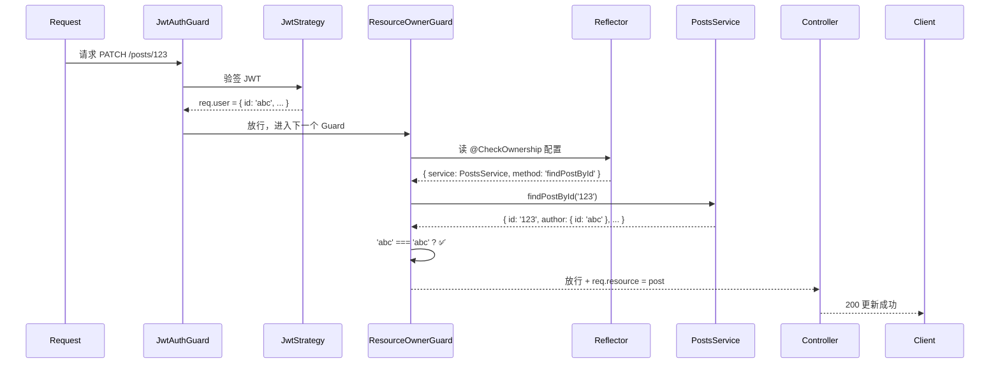

# 自定义装饰器

> NestJS 提供了三种创建自定义装饰器的方式，分别用于提取参数、标记元数据和组合已有装饰器。这是实现声明式编程的核心工具。

## 为什么需要自定义装饰器

在 NestJS 中，装饰器无处不在：`@Controller()`、`@Get()`、`@UseGuards()`。但内置装饰器只能解决通用问题，当你有以下需求时，就需要自定义装饰器：

- 从请求中提取特定数据（如当前用户、租户 ID）
- 为路由标记自定义权限配置
- 将多个装饰器组合成一个，减少重复代码
- 实现声明式的权限校验（如 `@CheckOwnership`）

## 三种创建方式一览

| 方式 | 用途 | 常用 API |
|------|------|---------|
| 参数装饰器 | 提取请求中的数据 | `createParamDecorator()` |
| 元数据装饰器 | 给路由/类打标签 | `SetMetadata()` + `Reflector` |
| 组合装饰器 | 打包多个装饰器 | `applyDecorators()` |

## 一、参数装饰器 —— 提取请求数据

用 `createParamDecorator()` 可以创建自定义参数装饰器，从 `ExecutionContext` 中提取你想要的数据。

### 基本写法

```ts
import { createParamDecorator, ExecutionContext } from '@nestjs/common';

export const CurrentUser = createParamDecorator(
  (data: unknown, ctx: ExecutionContext) => {
    const request = ctx.switchToHttp().getRequest();
    return request.user;
  },
);
```

### 用法

```ts
@Get('profile')
profile(@CurrentUser() user: User) {
  // user 就是 req.user
  return user;
}
```

### 进阶：支持提取特定属性

通过 `data` 参数可以灵活指定要提取的字段：

```ts
import { createParamDecorator, ExecutionContext } from '@nestjs/common';

export const CurrentUser = createParamDecorator(
  (data: keyof User | undefined, ctx: ExecutionContext) => {
    const request = ctx.switchToHttp().getRequest();
    const user = request.user;
    return data ? user?.[data] : user;
  },
);
```

```ts
// 获取整个 user 对象
@Get()
getProfile(@CurrentUser() user: User) { ... }

// 只获取 user.id
@Get()
getProfile(@CurrentUser('id') id: string) { ... }

// 只获取 user.role
@Get()
getProfile(@CurrentUser('role') role: string) { ... }
```

### 进阶：支持管道

自定义参数装饰器和 `@Body()`、`@Param()` 等内置装饰器地位相同，NestJS 在请求到来时会对**所有参数**统一应用管道，所以自定义装饰器上同样可以使用管道。

```ts
export const UserAgent = createParamDecorator(
  (data: unknown, ctx: ExecutionContext) => {
    const request = ctx.switchToHttp().getRequest();
    return request.headers['user-agent'];
  },
);
```

假设全局开启了 `ValidationPipe`：

```ts
// main.ts
app.useGlobalPipes(new ValidationPipe({ transform: true }));
```

那么所有参数（包括自定义装饰器的返回值）都会经过管道处理：

```ts
@Get()
getInfo(@UserAgent() ua: string) {
  // ua 自动经过了 ValidationPipe 的校验和转换
  return { userAgent: ua };
}
```

> **一句话总结**：管道对参数一视同仁，自定义装饰器不需要任何额外配置就能享受管道能力。

### 当装饰器返回 Promise 时

装饰器的工厂函数可以是 `async` 的，NestJS 会自动 `await` 返回的 Promise，注入到参数里的是**已解析的结果**，不是 Promise。

**定义装饰器：**

```ts
import { createParamDecorator, ExecutionContext } from '@nestjs/common';

export const PostEntity = createParamDecorator(
  async (data: unknown, ctx: ExecutionContext) => {
    const request = ctx.switchToHttp().getRequest();
    const id = request.params.id;
    // 异步查数据库
    const post = await postsRepository.findById(id);
    return post; // ← 返回 Promise<Post>
  },
);
```

**在 Controller 中使用：**

```ts
@Get(':id')
async getPost(@PostEntity() post: Post) {
  // post 已经是查出来的实体，不是 Promise<Post>
  return new ApiResponseDto('获取成功', post);
}
```

**执行流程：**

```
请求 GET /posts/123
  → 装饰器工厂执行：await postsRepository.findById('123')
  → Promise resolve，得到 { id: '123', title: '...' }
  → NestJS 将结果注入 @PostEntity() post 参数
  → Controller 方法执行
```

> **一句话总结**：`async` 装饰器和同步写法几乎一样，NestJS 会在调用 Controller 之前帮你 `await`。你可以在装饰器里做任何异步操作——查数据库、调微服务、读缓存——Controller 拿到的永远是最终结果。

## 二、元数据装饰器 —— 给路由"打标签"

使用 `SetMetadata()` 配合 `Reflector`，可以为路由附加自定义配置，供 Guard、Interceptor 读取。

### 工作流程

```
@CheckOwnership({ service: PostsService })
@Patch(':id')
update(...) { ... }
        │
        ▼
SetMetadata('ownership-config', { service: PostsService })
        │
        ▼
Guard 中通过 Reflector.get('ownership-config', handler) 读取配置
```

### 创建元数据装饰器

```ts
import { SetMetadata } from '@nestjs/common';

export const ROLES_KEY = 'roles';

// @Roles('admin')  →  等价于 SetMetadata('roles', ['admin'])
export const Roles = (...roles: string[]) => SetMetadata(ROLES_KEY, roles);
```

### 在 Guard 中读取

```ts
import { Injectable, CanActivate, ExecutionContext } from '@nestjs/common';
import { Reflector } from '@nestjs/core';

@Injectable()
export class RolesGuard implements CanActivate {
  constructor(private reflector: Reflector) {}

  canActivate(context: ExecutionContext): boolean {
    // 读取方法上的 @Roles 配置
    const requiredRoles = this.reflector.getAllAndOverride<string[]>(
      ROLES_KEY,
      [
        context.getHandler(),  // 方法级
        context.getClass(),    // 类级（方法级优先）
      ],
    );

    if (!requiredRoles) return true; // 没配 → 放行

    const { user } = context.switchToHttp().getRequest();
    return requiredRoles.includes(user.role); // admin? user?
  }
}
```

### 读取方式的区别

| API | 行为 |
|-----|------|
| `reflector.get(key, handler)` | 只读方法级，没配返回 `undefined` |
| `reflector.getAllAndMerge(key, [handler, class])` | 方法 + 类合并（数组并集） |
| `reflector.getAllAndOverride(key, [handler, class])` | 方法级有就覆盖类级 |

```ts
// 例子：类级默认 + 方法级覆盖
@Roles('user')                   // ← 类级默认：所有方法需要 user 角色
@Controller('cats')
export class CatsController {
  @Roles('admin')                // ← 方法级覆盖：这个方法需要 admin
  @Delete(':id')
  deleteCat() { ... }

  @Get()                         // ← 没覆盖，继承类级：需要 user
  getCats() { ... }
}
```

## 三、组合装饰器 —— 把多个装饰器打包

当同一个路由上装饰器越来越多，可以用 `applyDecorators()` 合并：

### 问题场景

```ts
// ❌ 装饰器越叠越多，每个路由都要写
@UseGuards(JwtAuthGuard, ResourceOwnerGuard)
@SetMetadata('resource', 'post')
@SetMetadata('action', 'delete')
@ApiBearerAuth()
@ApiOperation({ summary: '删除帖子' })
@Delete(':id')
async deletePost() { ... }
```

### 使用组合装饰器

```ts
import { applyDecorators, UseGuards, SetMetadata } from '@nestjs/common';

export function AuthOwner(resource: string, action: string = 'write') {
  return applyDecorators(
    UseGuards(JwtAuthGuard, ResourceOwnerGuard),
    SetMetadata('resource', resource),
    SetMetadata('action', action),
  );
}
```

### 使用后

```ts
// ✅ 一行替代四行，语义清晰
@AuthOwner('post', 'delete')
@ApiBearerAuth()
@ApiOperation({ summary: '删除帖子' })
@Delete(':id')
async deletePost() { ... }
```

### 进阶：带配置对象的组合装饰器

当配置项较多时，用对象传参更清晰：

```ts
interface OwnershipConfig {
  service: any;
  method?: string;
  ownerPath?: string;
  paramName?: string;
}

export const OWNERSHIP_CONFIG_KEY = Symbol('ownership');

export function CheckOwnership(config: OwnershipConfig) {
  return SetMetadata(OWNERSHIP_CONFIG_KEY, config);
}

export function AuthOwner(config: OwnershipConfig) {
  return applyDecorators(
    UseGuards(JwtAuthGuard, ResourceOwnerGuard),
    CheckOwnership(config),
  );
}
```

```ts
// 使用
@AuthOwner({
  service: PostsService,
  method: 'findPostById',
  ownerPath: 'author.id',
})
@Patch(':id')
async update() { ... }
```

## 四、实战示例：资源所有权守卫

下面是一个完整的实战案例，将三种装饰器组合起来，实现声明式的资源所有权验证。

### 项目文件结构

```
server/src/common/
├── decorators/
│   ├── current-user.decorator.ts   # 参数装饰器
│   ├── ownership.decorator.ts      # 元数据装饰器
│   └── auth.decorator.ts           # 组合装饰器
└── guards/
    └── resource-owner.guard.ts     # Guard 消费者
```

### 1. 参数装饰器 `@CurrentUser()`

```ts
// current-user.decorator.ts
import { createParamDecorator, ExecutionContext } from '@nestjs/common';
import { User } from 'src/modules/users/entities/user.entity';

export const CurrentUser = createParamDecorator(
  (data: keyof User | undefined, ctx: ExecutionContext) => {
    const request = ctx.switchToHttp().getRequest();
    const user = request.user as User;
    return data ? user?.[data] : user;
  },
);
```

### 2. 元数据装饰器 `@CheckOwnership()`

```ts
// ownership.decorator.ts
import { SetMetadata } from '@nestjs/common';

export const OWNERSHIP_CONFIG_KEY = Symbol('ownership-config');

export interface OwnershipConfig {
  service: any;
  method?: string;
  ownerPath?: string;
  paramName?: string;
}

export const CheckOwnership = (config: OwnershipConfig) =>
  SetMetadata(OWNERSHIP_CONFIG_KEY, config);
```

### 3. 组合装饰器 `@AuthOwner()`

```ts
// auth.decorator.ts
import { applyDecorators, UseGuards } from '@nestjs/common';
import { JwtAuthGuard } from 'src/auth/guards/jwt.guard';
import { ResourceOwnerGuard } from '../guards/resource-owner.guard';
import { CheckOwnership, OwnershipConfig } from './ownership.decorator';

export function AuthOwner(config: OwnershipConfig) {
  return applyDecorators(
    UseGuards(JwtAuthGuard, ResourceOwnerGuard),
    CheckOwnership(config),
  );
}
```

### 4. Guard 消费装饰器

```ts
// resource-owner.guard.ts
import {
  CanActivate, ExecutionContext, ForbiddenException,
  Injectable, NotFoundException, Type,
} from '@nestjs/common';
import { Reflector, ModuleRef } from '@nestjs/core';
import { OWNERSHIP_CONFIG_KEY, OwnershipConfig } from '../decorators/ownership.decorator';

@Injectable()
export class ResourceOwnerGuard implements CanActivate {
  constructor(
    private reflector: Reflector,
    private moduleRef: ModuleRef,
  ) {}

  async canActivate(context: ExecutionContext): Promise<boolean> {
    const config = this.reflector.getAllAndOverride<OwnershipConfig>(
      OWNERSHIP_CONFIG_KEY,
      [context.getHandler(), context.getClass()],
    );
    if (!config) return true;

    const request = context.switchToHttp().getRequest();
    const user = request.user;
    if (!user) throw new ForbiddenException('请先登录');

    const {
      service: ServiceClass,
      method = 'findOneById',
      ownerPath = 'author.id',
      paramName = 'id',
    } = config;

    const service = this.moduleRef.get(ServiceClass as Type, { strict: false });
    const resource = await service[method](request.params[paramName]);
    if (!resource) throw new NotFoundException('资源不存在');

    const ownerId = ownerPath.split('.').reduce((obj, key) => obj?.[key], resource);
    if (ownerId !== user.id) throw new ForbiddenException('只能操作自己的资源');

    request.resource = resource;
    return true;
  }
}
```

### 最终效果

```ts
@Controller('posts')
export class PostsController {
  constructor(private readonly postsService: PostsService) {}

  // 一个装饰器完成 认证 + 资源所有权校验
  @AuthOwner({ service: PostsService, method: 'findPostById' })
  @Patch(':id')
  async update(@Param('id') id: string, @Body() dto: UpdatePostDto) {
    // 这里只写纯业务逻辑，不需要任何权限判断代码
    const updated = await this.postsService.update(id, dto);
    return new ApiResponseDto('更新成功', updated);
  }
}
```

### 执行流程



## 相关链接

- [/frameworks/NestJS/guard](/frameworks/NestJS/guard) - 守卫详解
- [/frameworks/NestJS/auth-guard-strategy](/frameworks/NestJS/auth-guard-strategy) - Guard 与 Strategy 协作
- [/frameworks/NestJS/authorization](/frameworks/NestJS/authorization) - 身份认证
- [/frameworks/NestJS/request-lifecycle](/frameworks/NestJS/request-lifecycle) - 请求生命周期（理解装饰器执行顺序）
