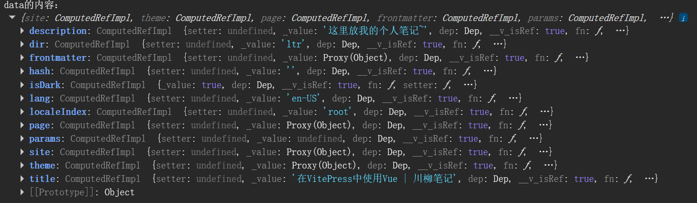

<script setup>
    import { ref } from 'vue';
    const count = ref(0);


    
    import { useData } from 'vitepress'
    const data = useData()
    console.log('data的内容：', data)


    import MyComponent from './components/MyComponent.vue'
</script>

# 在VitePress中使用Vue

在VitePress的md中，可以使用Vue功能。

## 模板化

### 插值语法

可以在文本中使用 Vue 的插值语法：

输入

```
{{ 1 + 1 }}
```

输出

```
2
```

### 指令

也可以使用指令：

输入

```html
<span v-for="i in 3">{{ i }}</span>
```

输出

```
1 2 3
```

::: tip
markdown原版也可以使用html。不过markdown原版不能使用vue语法。
:::

## `<script>` 和 `<style>`

所有标签都应放在 frontmatter 之后。

```html
--- 
hello: world 
---

<script setup>
  import { ref } from "vue";

  const count = ref(0);
</script>

The count is : {{count}}

<button :class="$style.button" @click="count++">Increment</button>

<style module>
  .button {
    color: red;
    font-weight: bold;
  }
</style>
```

效果：

The count is : {{count}}

<button :class="$style.button" @click="count++">Increment</button>

<style module>
.button {
  color: red;
  font-weight: bold;
}
</style>

::: warning
避免在 Markdown 中使用 `<style scoped>`

在 Markdown 中使用时，`<style scoped>` 需要为当前页面的每个元素添加特殊属性，这将显著增加页面的大小。当我们需要局部范围的样式时 `<style module>` 是首选。
:::

还可以访问 VitePress 的运行时 API，例如 useData 辅助函数，它提供了当前页面的元数据：

```html
<script setup>
    import { useData } from 'vitepress'
    const data = useData()
    console.log('data的内容：', data)
</script>
```

效果：



## 使用 Vue 组件 

可以直接在 Markdown 文件中导入和使用 Vue 组件。

### 导入组件

如果一个组件只被几个页面使用，建议在使用它们的地方显式导入它们。这使它们可以正确地进行代码拆分，并且仅在显示相关页面时才加载：
``` html
<script setup>
    import MyComponent from './components/MyComponent.vue'
</script>

应用我自己的组件：
<MyComponent />

```
::: details 查看组件源码
``` vue
<script setup lang="ts">
import { ref, onMounted, onUnmounted } from 'vue'

const colors = ['#e74c3c', '#e67e22', '#f1c40f', '#2ecc71', '#3498db', '#9b59b6']
const i = ref(0)
let timer: number

onMounted(() => {
  timer = setInterval(() => { i.value = (i.value + 1) % colors.length }, 500)
})

onUnmounted(() => clearInterval(timer))
</script>

<template>
  <span class="rainbow" :style="{ color: colors[i] }">你好！</span>
</template>

<style scoped>
.rainbow {
  font-size: 2rem;
  font-weight: bold;
  transition: color 0.3s;
}
</style>

```
:::
效果：

应用我自己的组件：
<MyComponent />


### 全局组件

如果一个组件要在大多数页面上使用，可以通过自定义 Vue 实例来全局注册它们。有关示例，请参见自定义主题中的相关部分。

::: warning
确保自定义组件的名称包含连字符或采用 PascalCase。否则，它将被视为内联元素并包裹在 `<p>` 标签内，这将导致激活不匹配，因为 `<p>` 不允许将块元素放置在其中。
::: 

::: tip
更多内容请查阅[官方文档](https://vitepress.dev/zh/guide/using-vue)
:::