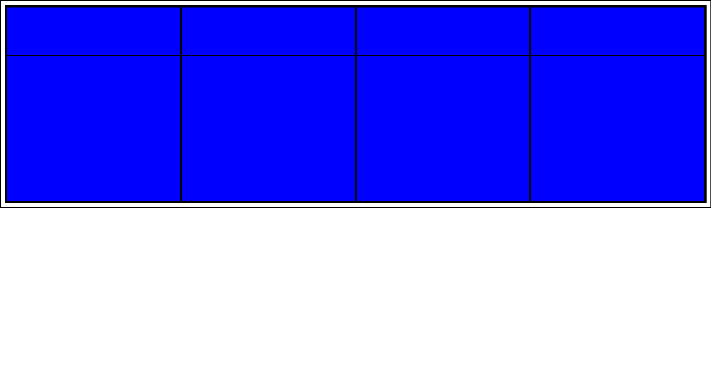

# Grid 布局

网格是一组相交的水平线和垂直线，它定义了网格的列和行。

CSS 提供了一个基于网格的布局系统，带有行和列，可以让我们更轻松地设计网页。

## 父元素和子元素

网格布局由一个父元素和一个或多个子元素构成。下文称父元素叫网格容器，子元素叫网格元素。

```html
<div class="grid-container">
  <div class="grid-item">1</div>
  <div class="grid-item">2</div>
  <div class="grid-item">3</div>
</div>
```

当一个html元素将display属性设置为grid或者inline-grid后，他就变成了一个网格容器。这个元素的所有直系子元素将成为网格元素。

```css
.grid-container {
  display: grid;
}

/**
或者这样：
.grid-container {
    display: inline-grid;
}
*/
```

## 网格轨道

通过 `grid-template-columns` 和 `grid-template-rows` 属性来定义网格中的列和行。
这两个属性定义了网格的轨道。一个轨道就是网格中任意两条线之间的空间。

例子：

```html
<div class="grid-container root">
  <div class="box box1"></div>
  <div class="box box2"></div>
  <div class="box box3"></div>
  <div class="box box4"></div>
  <div class="box box5"></div>
  <div class="box box6"></div>
  <div class="box box7"></div>
  <div class="box box8"></div>
</div>
```

```css
.grid-container {
  display: grid;
  grid-template-columns: auto auto auto auto;
  grid-template-rows: 100px 300px;
}

* {
  box-sizing: border-box;
  border: 2px solid;
}
.root {
  background-color: aqua;
}
.box {
  width: 100%;
  height: 100%;
  background-color: blue;
}
```

效果：


## fr单位

轨道的长度可以使用任意长度单位进行定义。
网格引入了`fr`单位帮助我们灵活创建网格轨道。  
一个`fr`单位代表网格容器中可用空间的一等份。  

例子：
``` css
/* 这样可以三等分，每一行占1份 */
.grid-container {
  display: grid;
  grid-template-columns: 1fr 1fr 1fr;
}

/*下面这个，就是2:3:4的意思 */
.grid-container {
  display: grid;
  grid-template-columns: 2fr 3fr 4fr;
}
```

## 网格单元

一个网格单元就是两行两列交叉的那个中间的块。是一个网格元素最小的单位。

## 网格区域

一个网格区域由多个网格单元组成。网格区域只能是矩形。比如，可以两行两列的四个网格单元组成一个网格区域，网格元素占有这个区域。

## 网格间距

字面意思。网格单元与网格单元之间的距离。可以使用以下三个属性来设置。
- `grid-column-gap`
- `grid-row-gap`
- `grid-gap`
::: tip
`grid-gap`可以看作`grid-column-gap`与`grid-row-gap`的缩写。比如：
``` css
.container1 {
    grid-gap: 50px 100px;
}

.container2 {
    grid-column-gap: 50px;
    grid-row-gap: 100px
}

```
:::

::: warning

`grid-gap`等这三个属性已经过时了。现在最好直接使用`gap`属性

:::

## 网格线

列与列，行与行之前的交界处就是网格线。  
从上往下是1，2，3条，从左往右数是1，2，3条。

比如

```css
.item1 {
  grid-column-start: 1;
  grid-column-end: 3;
}
```
设置从第一列开始，第三行结束。