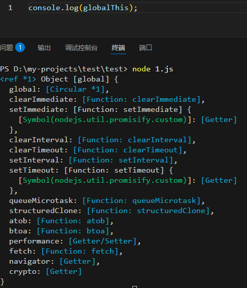

<script setup>
import WipTag from '@components/WipTag.vue'
</script>

# 执行上下文

## 什么是执行上下文？

**执行上下文（Execution Context）** 是 ECMAScript 规范中定义的抽象概念，用于描述 JavaScript 代码运行时的环境。

## 执行上下文的三种类型

| 类型                | 创建时机                              |
| ------------------- | ------------------------------------- |
| **全局执行上下文**  | JavaScript 引擎启动时（有且仅有一个） |
| **函数执行上下文**  | 每次函数调用时                        |
| **Eval 执行上下文** | `eval()` 被调用时                     |
| **模块执行上下文**  | import/export 的 ESM 文件             |

这几个详解待完善
<WipTag />

### 全局执行上下文（Global Execution Context）

### 函数执行上下文（Function Execution Context

### Eval 执行上下文

## 执行上下文的内部结构

每个执行上下文在规范层面包含三个核心组件，下面是执行上下文的伪代码：

```js
ExecutionContext = {
  LexicalEnvironment:   { ... },   // 词法环境
  VariableEnvironment:  { ... },   // 变量环境
  ThisBinding:          value,   // this 绑定
}
```

### 1. this 绑定

记录当前上下文中 `this` 的值。不同上下文的 `this` 来源不同：

- 首先是全局上下文：

浏览器环境下，`this` 指向 `window` 对象


node.js环境下，`globalThis` 指向 `global` 对象



::: tip
node.js环境下，在文件最顶层写的代码不是在全局执行上下文中运行，而是在模块上下文，所以不能直接写this。
:::

::: tip
global的global属性的circular *1 的意思是循环引用1， 然后global对象声明为了ref *1，这就是一个循环引用的意思。
:::

- 函数执行上下文：动态绑定。
  - 当函数前面有 `new` 关键字时，`this` 指向新创建的那个实例对象。
  - 通过 `call`、`apply` 或 `bind` 强行指定 `this` 指向传入的第一个参数。
  - 当函数通过 `对象.方法()` 的形式调用时，`this` 指向点（`.`）前面的那个对象。
  - 当函数啥也不挂，直接 `func()` 这样裸奔调用时：
    - 非严格模式：`this` 指向全局对象（浏览器 `window`，Node `global`）。
    - 严格模式（`'use strict'`）：`this` 为 `undefined`。

### 2. 词法环境

英文是LexicalEnvironment

#### 词法环境的内容

词法环境记录以下内容：

- 使用 `let` 声明的变量（如 `let b = 2`）
- 使用 `const` 声明的常量（如 `const c = 3`）
- 使用 `class` 声明的类

#### 词法环境的构成

词法环境由**环境记录器**与**对外部环境的引用**两个组件组成。

- **环境记录器**：用于存储当前环境中的变量和函数声明的实际位置。
- **外部环境的引用**：指向可以访问的其它外部环境（所以子作用域可以访问父作用域）。

#### 词法环境的类型

##### 全局环境（对象环境记录器）

没有外部环境引用（为 `null`）。它拥有内建的 `Object`、`Array` 等、在环境记录器内的原型函数（关联全局对象，比如 `window` 对象）和任何用户定义的全局变量，并且 `this` 的值指向全局对象。

##### 函数环境（声明式环境记录器）

存储着函数内部定义的变量。引用的外部环境可能是全局环境，或者任何包含此函数的外部函数环境。它还包含了用户在函数中定义的所有属性方法，以及一个 `arguments` 对象和传递给函数的参数的 `length`。

#### 伪代码示例

```ts
// 全局环境
GlobalExecutionContext = {
  // 词法环境
  LexicalEnvironment: {
    // 对象环境记录器
    EnvironmentRecord: {
      Type: "Object",
      // 在这里绑定标识符
    },
    outer: null
  }
}

// 函数环境
FunctionExecutionContext = {
  // 词法环境
  LexicalEnvironment: {
    // 声明式环境记录器
    EnvironmentRecord: {
      Type: "Declarative",
      // 在这里绑定标识符
    },
    // 外部环境的引用
    outer: <全局环境或包含该函数的外部函数环境>
  }
}
```

### 3. VariableEnvironment（变量环境）

变量环境也是一个词法环境，它**专门存放 `var` 声明的变量和函数声明**。

#### 与词法环境的区别

|                    | LexicalEnvironment                            | VariableEnvironment                    |
| ------------------ | --------------------------------------------- | -------------------------------------- |
| **存放内容**       | `let`、`const`、`class`                       | `var` 声明、函数声明                   |
| **随块 `{}` 变化** | ✅ 每进入一个块就创建新的环境记录             | ❌ 整个函数/全局共用一个               |
| **初始化时机**     | 创建阶段放入，标记为 `<uninitialized>`（TDZ） | 创建阶段放入，直接初始化为 `undefined` |

#### 为什么需要变量环境？

这是为了兼容 `var` 的历史行为——`var` 没有块级作用域，只有函数/全局作用域。在同一个函数内，无论 `var` 写在哪个 `{}` 块里，它都属于同一个变量环境。

#### 代码演示环境的功能

```ts
let a = 20;
const b = 30;
var c;

function multiply(e, f) {
  var g = 20;
  return e * f * g;
}

c = multiply(20, 30);
```

对应的环境伪代码：

```ts
GlobalExectionContext = {
  ThisBinding: <Global Object>,
  // 词法环境
  LexicalEnvironment: {
    EnvironmentRecord: {
      Type: "Object",
      // 存储 let/const 变量绑定（处于 TDZ）
      a: <uninitialized>,
      b: <uninitialized>,
    },
    outer: <null>
  },
  // 变量环境
  VariableEnvironment: {
    EnvironmentRecord: {
      Type: "Object",
      // 存储 var 变量和函数声明（直接初始化）
      c: undefined,
      multiply: <func>
    },
    outer: <null>
  }
}

FunctionExectionContext = {
  ThisBinding: <Global Object>,
  // 词法环境
  LexicalEnvironment: {
    EnvironmentRecord: {
      Type: "Declarative",
      // 存储 let/const 变量绑定（本例中没有）
    },
    outer: <GlobalEnvironmentRecord>
  },
  // 变量环境
  VariableEnvironment: {
    EnvironmentRecord: {
      Type: "Declarative",
      // 存储 var 变量、函数声明和参数
      Arguments: { 0: 20, 1: 30, length: 2 },
      e: 20,
      f: 30,
      g: undefined
    },
    outer: <GlobalEnvironmentRecord>
  }
}
```

## 执行上下文栈（Call Stack）

JS 引擎用**栈（LIFO）** 结构管理所有执行上下文：

```js
function foo() {
  console.log("foo");
  bar();
}

function bar() {
  console.log("bar");
}

foo();
```

```
调用栈变化过程：

1. 脚本启动       → [ 全局上下文 ]              ← 栈底
2. 调用 foo()     → [ 全局上下文 | foo上下文 ]
3. 调用 bar()     → [ 全局上下文 | foo上下文 | bar上下文 ]  ← 栈顶(当前执行)
4. bar() 返回     → [ 全局上下文 | foo上下文 ]   ← bar 出栈销毁
5. foo() 返回     → [ 全局上下文 ]               ← foo 出栈销毁
6. 页面关闭       → [ ]                          ← 全局上下文销毁
```

**栈顶的上下文永远是"当前正在执行的上下文"。**

## 执行上下文的生命周期 <WipTag />
