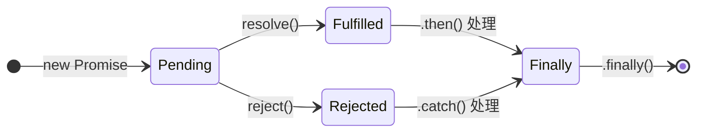

# Promise

## 什么是 Promise？

**Promise** 是 ES6 引入的一种异步编程解决方案，用于解决回调地狱（callback hell）问题。它代表一个**异步操作的最终完成（或失败）及其结果值**。

一个 Promise 有三种状态：



| 状态 | 说明 | 是否可逆 |
|------|------|:--------:|
| **pending**（待定） | 初始状态，既未完成也未拒绝 | — |
| **fulfilled**（已完成） | 操作成功完成 | ❌ 不可逆 |
| **rejected**（已拒绝） | 操作失败 | ❌ 不可逆 |

一旦状态从 pending 变为 fulfilled 或 rejected，就**不可再变**——这称为 Promise 的"决议"（settled）。

## 基本用法

```js
const promise = new Promise((resolve, reject) => {
  // 异步操作
  setTimeout(() => {
    const success = true
    if (success) {
      resolve('成功了')
    } else {
      reject('失败了')
    }
  }, 1000)
})

promise
  .then((value) => {
    console.log(value) // '成功了'
  })
  .catch((err) => {
    console.error(err) // '失败了'
  })
  .finally(() => {
    console.log('无论成功失败都会执行')
  })
```

## 链式调用

`.then()` / `.catch()` / `.finally()` 都返回**一个新的 Promise**，因此可以链式调用。

```js
fetchUser(1)
  .then((user) => fetchPosts(user.id))   // 返回新 Promise
  .then((posts) => renderPosts(posts))   // 拿到上一个 then 的返回值
  .catch((err) => console.error(err))
```

::: warning 注意
`.then()` 中 `return` 的值会被自动包装成 `Promise.resolve()`。如果 return 的是一个 Promise，则下一个 `.then()` 会等它 resolve 后再执行。
:::

## Promise 静态方法

### Promise.resolve() / Promise.reject()

快速创建已决议的 Promise：

```js
Promise.resolve(42)       // 等价于 new Promise(resolve => resolve(42))
Promise.reject('出错了')   // 等价于 new Promise((_, reject) => reject('出错了'))
```

### Promise.all()

等待**所有** Promise 完成。全部成功则返回结果数组，**有一个失败就立即 reject**。

```js
Promise.all([p1, p2, p3])
  .then(([r1, r2, r3]) => {
    // 全部成功，r1/r2/r3 与 p1/p2/p3 顺序一致
  })
  .catch((err) => {
    // 任意一个失败就到这里，拿到第一个失败的错误
  })
```

### Promise.allSettled()

等待所有 Promise **全部 settled**（无论成功失败），返回每个的结果描述。

```js
Promise.allSettled([p1, p2, p3]).then((results) => {
  // results = [
  //   { status: 'fulfilled', value: '结果1' },
  //   { status: 'rejected', reason: '错误2' },
  //   { status: 'fulfilled', value: '结果3' },
  // ]
})
```

### Promise.race()

**竞速**——返回第一个 settled 的 Promise 结果（无论成功失败）。

```js
Promise.race([p1, p2, p3]).then((result) => {
  // 谁先完成就拿谁的结果
})
```

### Promise.any()

返回**第一个 fulfilled** 的 Promise。如果全部失败，则 reject 并返回 AggregateError。

```js
Promise.any([p1, p2, p3])
  .then((result) => {
    // 拿到第一个成功的
  })
  .catch((err) => {
    // 全部失败
  })
```

### 静态方法对比

| 方法 | 返回时机 | 失败处理 | ES 版本 |
|------|---------|---------|:------:|
| `all` | 全部成功 / 第一个失败 | 一个失败就 reject | ES2015 |
| `allSettled` | 全部 settled | 不 reject，逐个报告状态 | ES2020 |
| `race` | 第一个 settled | 看第一个的结果 | ES2015 |
| `any` | 第一个 fulfilled / 全部失败 | 全部失败才 reject | ES2021 |

## async / await

`async/await` 是 Promise 的**语法糖**，让异步代码看起来像同步代码。

```js
// Promise 写法
function getUser() {
  return fetch('/api/user').then((res) => res.json())
}

// async/await 写法
async function getUser() {
  const res = await fetch('/api/user')
  return res.json()
}
```

### 核心规则

- `async` 函数**始终返回 Promise**（非 Promise 返回值会被自动包装）
- `await` 只能在 `async` 函数内部使用
- `await` 会"暂停"函数执行，等待 Promise settled 后继续
- `await` 后面的代码等价于 `.then()` 回调，属于**微任务**

### 错误处理

```js
// 方式1：try/catch
async function fetchData() {
  try {
    const data = await fetch('/api/data')
  } catch (err) {
    console.error('请求失败', err)
  }
}

// 方式2：.catch()
async function fetchData() {
  const data = await fetch('/api/data').catch((err) => {
    console.error('请求失败', err)
  })
}
```

## 常见面试题

### 题1：手写 Promise.all

```js
function myPromiseAll(promises) {
  return new Promise((resolve, reject) => {
    if (!Array.isArray(promises)) {
      return reject(new TypeError('参数必须是数组'))
    }

    const results = []
    let count = 0

    promises.forEach((p, index) => {
      Promise.resolve(p).then(
        (value) => {
          results[index] = value  // 按原顺序存放
          count++
          if (count === promises.length) {
            resolve(results)
          }
        },
        (reason) => {
          reject(reason) // 一个失败就 reject
        }
      )
    })

    // 空数组直接 resolve
    if (promises.length === 0) resolve([])
  })
}
```

### 题2：手写 Promise.race

```js
function myPromiseRace(promises) {
  return new Promise((resolve, reject) => {
    promises.forEach((p) => {
      Promise.resolve(p).then(resolve, reject)
    })
  })
}
```

### 题3：说出以下代码的输出

```js
Promise.resolve()
  .then(() => {
    console.log('1')
    return Promise.resolve('2')
  })
  .then((value) => {
    console.log(value)
  })

Promise.resolve()
  .then(() => {
    console.log('3')
  })
  .then(() => {
    console.log('4')
  })
```

::: details 答案
```
1
3
2
4
```
**解析**：当 `.then()` 中 `return` 一个 Promise 时，下一个 `.then()` 要等它 resolve 才会执行（会有额外 2 次微任务延迟）。
:::

### 题4：说出以下代码的输出

```js
console.log('1')

setTimeout(() => {
  console.log('2')
  Promise.resolve().then(() => console.log('3'))
}, 0)

new Promise((resolve) => {
  console.log('4')
  resolve()
}).then(() => {
  console.log('5')
})

console.log('6')
```

::: details 答案
```
1
4
6
5
2
3
```
:::

### 题5：Promise.resolve() 传入一个 Promise 会怎样？

::: details 答案
`Promise.resolve()` 传入一个 Promise 时，会**直接返回该 Promise 本身**，不会做额外包装。

```js
const p = new Promise((resolve) => resolve('a'))
const result = Promise.resolve(p)
console.log(result === p) // true
```
:::

### 题6：Promise 构造函数里报错，会怎样？

::: details 答案
Promise 构造函数内部的同步错误会被自动捕获，导致 Promise 变为 rejected 状态。

```js
const p = new Promise((resolve, reject) => {
  throw new Error('出错了')
})

p.catch((err) => console.log(err.message)) // '出错了'
```

等价于 `reject(new Error('出错了'))`。但如果是**异步错误**（如 setTimeout 里抛错），不会被捕获。
:::

### 题7：async 函数中多个 await 是并行还是串行？

::: details 答案
默认是**串行**，一个 await 完成后才执行下一个。

```js
// 串行
const a = await fetchA()
const b = await fetchB()

// 并行：先发起请求，再 await
const [a, b] = await Promise.all([fetchA(), fetchB()])
```
:::
