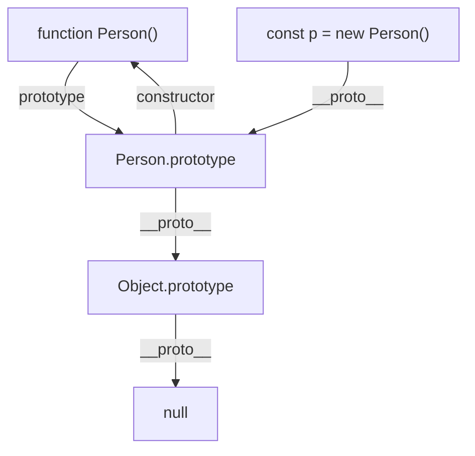

<script setup>
import WipTag from '@components/WipTag.vue'
</script>

# 原型与原型链

## 什么是原型？

在 JavaScript 中，**每个对象都有一个内部属性 `[[Prototype]]`**，指向它的原型对象。原型对象本身也是一个对象，它包含可以被该对象继承的属性和方法。

可以通过以下方式访问对象的原型：

- `Object.getPrototypeOf(obj)`（推荐）
- `obj.__proto__`（非标准，但大多数浏览器支持）

```js
const obj = {}
console.log(Object.getPrototypeOf(obj) === Object.prototype) // true
```

## 什么是原型链？

**原型链**是 JavaScript 实现继承的主要机制。当访问一个对象的属性或方法时：

1. 首先在对象自身查找
2. 如果找不到，沿着 `[[Prototype]]` 向上查找原型对象
3. 如果还找不到，继续沿着原型的原型向上查找
4. 直到找到属性或到达 `null`（原型链的终点）

```js
const arr = [1, 2, 3]

// arr → Array.prototype → Object.prototype → null
console.log(arr.__proto__ === Array.prototype)        // true
console.log(arr.__proto__.__proto__ === Object.prototype) // true
console.log(arr.__proto__.__proto__.__proto__)        // null
```

## `prototype` 与 `__proto__` 的区别

| 概念            | 所属       | 含义                                               |
| --------------- | ---------- | -------------------------------------------------- |
| `prototype`     | 函数       | 函数作为构造函数时，新实例的原型对象               |
| `__proto__`     | 对象       | 指向该对象的原型（即构造函数的 `prototype`）       |

```js
function Person(name) {
  this.name = name
}

const p = new Person('张三')

console.log(Person.prototype)          // Person 的原型对象
console.log(p.__proto__)               // 指向 Person.prototype
console.log(p.__proto__ === Person.prototype) // true
```

## `constructor` 属性

原型对象上默认有一个 `constructor` 属性，指向关联的构造函数：

```js
function Person() {}

console.log(Person.prototype.constructor === Person) // true

const p = new Person()
console.log(p.constructor === Person) // true（通过原型链找到）
```

## 原型链经典图



**图中关系总结：**

| 表达式                                      | 值                  |
| ------------------------------------------- | ------------------- |
| `Person.prototype`                          | Person 的原型对象   |
| `p.__proto__`                               | `Person.prototype`  |
| `Person.prototype.constructor`              | `Person`            |
| `Person.prototype.__proto__`                | `Object.prototype`  |
| `Object.prototype.__proto__`                | `null`              |
| `p.constructor`（沿原型链向上查找）         | `Person`            |

## 基于原型链的继承

### 原型链继承

```js
function Parent() {
  this.colors = ['red', 'blue']
}

function Child() {}

Child.prototype = new Parent()

const c1 = new Child()
const c2 = new Child()

c1.colors.push('green')
console.log(c2.colors) // ['red', 'blue', 'green'] — 引用类型被共享！
```

**缺点**：引用类型的属性会被所有实例共享。

### 构造函数继承（借用构造函数）

```js
function Parent(name) {
  this.name = name
  this.colors = ['red', 'blue']
}

function Child(name) {
  Parent.call(this, name) // 借用父类构造函数
}

const c1 = new Child('张三')
const c2 = new Child('李四')

c1.colors.push('green')
console.log(c1.colors) // ['red', 'blue', 'green']
console.log(c2.colors) // ['red', 'blue'] — 互不影响
```

**缺点**：无法继承父类原型上的方法。

### 组合继承（原型链 + 构造函数）

```js
function Parent(name) {
  this.name = name
  this.colors = ['red', 'blue']
}

Parent.prototype.sayName = function () {
  console.log(this.name)
}

function Child(name, age) {
  Parent.call(this, name) // 第二次调用 Parent
  this.age = age
}

Child.prototype = new Parent() // 第一次调用 Parent
Child.prototype.constructor = Child

Child.prototype.sayAge = function () {
  console.log(this.age)
}
```

**缺点**：父类构造函数被调用了两次。

### 寄生组合式继承（最优方案）

```js
function Parent(name) {
  this.name = name
  this.colors = ['red', 'blue']
}

Parent.prototype.sayName = function () {
  console.log(this.name)
}

function Child(name, age) {
  Parent.call(this, name)
  this.age = age
}

// 核心：用 Object.create 避免二次调用父类构造函数
Child.prototype = Object.create(Parent.prototype)
Child.prototype.constructor = Child

Child.prototype.sayAge = function () {
  console.log(this.age)
}
```

### ES6 class 继承

```js
class Parent {
  constructor(name) {
    this.name = name
  }

  sayName() {
    console.log(this.name)
  }
}

class Child extends Parent {
  constructor(name, age) {
    super(name) // 必须先调用 super()
    this.age = age
  }

  sayAge() {
    console.log(this.age)
  }
}
```

::: tip
`class` 语法本质上是原型链继承的语法糖。`Child` 的原型仍然指向 `Parent` 的原型，底层还是基于原型链。
:::

## `instanceof` 原理

`instanceof` 运算符用于检测构造函数的 `prototype` 属性是否出现在某个实例对象的原型链上。

```js
function myInstanceof(instance, constructor) {
  let proto = Object.getPrototypeOf(instance)

  while (proto) {
    if (proto === constructor.prototype) return true
    proto = Object.getPrototypeOf(proto)
  }

  return false
}

// 测试
console.log(myInstanceof([], Array))    // true
console.log(myInstanceof([], Object))   // true
console.log(myInstanceof({}, Array))    // false
```

## `Object.create()` 原理

```js
function myCreate(proto) {
  function F() {}
  F.prototype = proto
  return new F()
}
```

## `new` 操作符做了什么事？

```js
function myNew(constructor, ...args) {
  // 1. 创建一个新对象，原型指向构造函数的 prototype
  const obj = Object.create(constructor.prototype)

  // 2. 执行构造函数，绑定 this
  const result = constructor.apply(obj, args)

  // 3. 如果构造函数返回了对象，则返回该对象；否则返回新创建的对象
  return result instanceof Object ? result : obj
}
```

## 常见面试题

### 题1：说出以下代码的输出

```js
function Foo() {}
Foo.prototype.a = 1

const f1 = new Foo()
Foo.prototype = { a: 2, b: 3 }

const f2 = new Foo()

console.log(f1.a) // ?
console.log(f1.b) // ?
console.log(f2.a) // ?
console.log(f2.b) // ?
```

::: details 答案
```
1
undefined
2
3
```

**解析**：`f1` 的 `__proto__` 指向旧的 `Foo.prototype`（`{ a: 1 }`），而 `f2` 的 `__proto__` 指向新的 `Foo.prototype`（`{ a: 2, b: 3 }`）。重写 `prototype` 不会影响已创建的实例。
:::

### 题2：说出以下代码的输出

```js
Function.prototype.a = () => console.log(1)
Object.prototype.b = () => console.log(2)

function Foo() {}

const foo = new Foo()

foo.a() // ?
foo.b() // ?
Foo.a() // ?
```

::: details 答案
```
foo.a() // TypeError: foo.a is not a function
foo.b() // 2
Foo.a() // 1
```

**解析**：
- `foo` 的原型链：`foo → Foo.prototype → Object.prototype → null`，不经过 `Function.prototype`，所以 `foo.a` 不存在。
- `foo.b` 通过原型链在 `Object.prototype` 上找到。
- `Foo` 是一个函数，`Foo → Function.prototype → Object.prototype`，所以 `Foo.a` 在 `Function.prototype` 上找到。
:::
