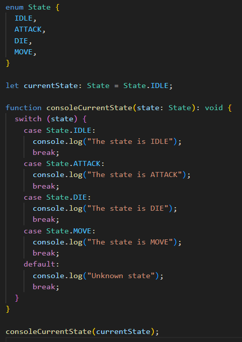

<script setup>
import WipTag from '@components/WipTag.vue'
</script>

# TypeScript 基础类型

## string 字符串

表示文本数据

```ts
const message: string = "Hello, TypeScript!";
```

**模板字符串**：用反引号来定义，允许在字符串中插入变量或者表达式。插入时用一个dollar符号和一个花括号包起来。

```ts
const my_name: string = "川柳呀";
const greeting: string = `Hello, ${my_name}!`;

console.log(greeting);
// Hello, 川柳呀！
```

## number 数字

number表示所有数字，包括整数和浮点数。

```ts
const age: number = 18;
const T_shirt_count: number = 9.15;
```

## boolean 布尔值

`true` or `false`

```ts
let isLoading = false;
```

## array 数组

可以表示一组相同类型的元素，有两种表示方法。

`type[]` 或者 `Array<type>` 这两种。

```ts
const names: Array<string> = ["chuanliuya", "大帅比", "桂林皮包大王"];
```

## tuple 元组

表示已知数量和类型的数组。

```ts
const person_location_index: [number, number] = [12, 56];
```

> 我基本没用过。要是已知数量和类型，为什么不直接用object对象呢？

## enum 枚举

定义一组常量。默认从零开始递增。可以在中途换值。



## any 任何

表示任何类型。

::: warning 尽量别用！
`any` 会关闭 TypeScript 的类型检查，等于把代码"降级"回 JavaScript。在 eslint 和 oxlint 中，显式使用 `any` 会触发 `no-explicit-any` 规则的警告。
:::

## void 空

通常用于没有返回值的函数。

``` ts{1}
function consoleText(text: string): void {
    console.log(text);
}
```

## null 空

还是空。但是这个空代表空值。表示什么都没有。
typeof 检测 null 是 object。

## undefind 未定义

表示未定义，值也是undefind。

``` ts
let myVar;
console.log(myVar) // undefind
console.log(typeof myVar) // undefind
```

## never 从不

永远不会有返回值，通常是抛出错误或者无限循环函数。该函数永远不会正常结束。

``` ts
function myFunc1(): never{
    throw new Error ("错误！")
}

function myFunc2(): never{
    while (true){
        console.log('永远不会结束。。。')
    }
}

```

## object 对象

没啥好讲的。

## union 联合类型

``` ts
let id: string | number = 1
```

## unknown 未知

与 `any` 类似，什么类型的值都能往里面放，但它是 `any` 的**安全**替代品。

区别在于：`any` 会直接关闭类型检查，而 `unknown` 会**保留**类型检查——不确认类型就不能随便操作它。

```ts
let value: unknown = "川柳"

// 报错！unknown 上不能直接调用 string 的方法
value.toUpperCase()

// 先做类型收窄（type narrowing）再使用
if (typeof value === "string") {
    value.toUpperCase()
}
```

**类型收窄**：用 `typeof`、`instanceof` 等判断把 `unknown` 收窄成具体类型，之后才能像该类型一样使用。

> 拿不准类型时，用 `unknown` 比 `any` 更安全。

## 字面量类型

字面量类型可以让变量只能拥有特定值。结合联合类型更好用。

``` ts
type State = "吃饭" | "睡觉" | "玩电脑~"
let myState :  State= "吃饭"

function what_are_you_doing(state: State) : void{
    console.log(state)
}

what_are_you_doing(myState)
```