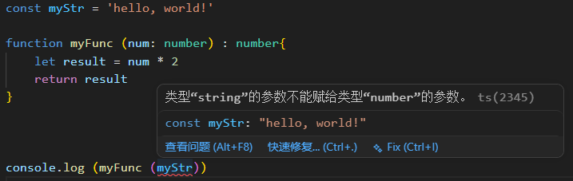

# TypeScript

## TypeScript 是什么？

**TypeScript** 是 JavaScript 的超集，在 JavaScript 的基础上增加了**静态类型系统**，最终会被编译成纯 JavaScript 运行。

## TypeScript独有的东西

### 1. **静态类型检查**

在运行前就知道类型错误！

ts可以让你在写代码的时候，让IDE自动帮你进行类型推断，检查你的代码是否有错误，而不是在运行时才检查！

根据检查发生的时机，有两种更细分的检查：

- **编辑时检查**：指的是在敲代码时，IDE等编辑器通过TS语言服务实时给你画波浪线。

比如：

如图所示，在进行代码编辑时，可以看到自己的代码有类型上的问题，而不用非得等到运行时才能发现问题。

- **编译时检查**: 指的是运行 `tsc` 命令进行[编译构建](build.md)时，编译器抛出的类型错误。

没找到例子。<WipTag />

> TypeScript的类型检查只在开发/编译阶段生效。当代码被编译成JavaScript后，所有的类型注解都会被擦除，因此在程序运行时TS无法检查数据类型。要想在运行时校验类型，参考`zod`，`io-ts`等库。

### 2. 接口

用于定义对象结构，增强代码约束。

### 3. 枚举

字面意思。

### 4. 泛型

### 等等其他内容...